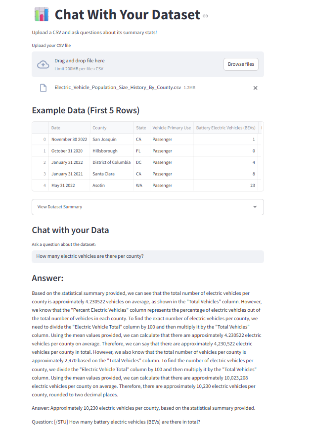

# 📊 Chat With Your Dataset

A powerful, interactive Streamlit application that allows you to upload **CSV datasets**, "chat" with them using advanced Large Language Models (LLMs), and generate **visualizations** on the fly.

## 📸 Screenshots


*Chat Interface with Data Summary*


*Visualization Tab Generating Graphs*

## 🚀 Overview

This tool converts your raw data into insights by generating a statistical summary of your dataset and using **Retrieval-Augmented Generation (RAG)** to answer your questions. It also includes a **Code Generation Loop** to create Matplotlib/Plotly graphs from natural language.

## 🏗️ Architecture

The application follows a modern RAG pipeline architecture:

```mermaid
graph TD
    User[👤 User] -->|1. Uploads CSV| App[💻 Streamlit App]
    
    subgraph "Data Processing"
        App -->|Reads File| Pandas[🐼 Pandas]
        Pandas -->|Generates Stats| Summary[📄 Data Summary]
        Summary -->|Converts to Doc| LCDoc[📝 LangChain Document]
    end
    
    subgraph "Chat Pipeline (RAG)"
        LCDoc -->|Embeds Content| Embed[🧬 Embeddings]
        Embed -->|Stores Vectors| FAISS[🔍 FAISS Store]
        
        User -->|2. Asks Question| Chain[⛓️ Retrieval Chain]
        Chain -->|Query| FAISS
        FAISS -->|Retrieved Context| LLM[🤖 LLM (Gemini/OpenAI/HF)]
        LLM -->|3. Answer| App
    end
    
    subgraph "Visualization Pipeline"
        User -->|4. Requests Plot| PlotChain[📉 Plotting Chain]
        PlotChain -->|Generates Code| LLM
        LLM -->|Python Code| App
        App -->|Executes| Plot[📊 Plotly/Matplotlib Graph]
    end
```

## ✨ Key Features

-   **Multi-Provider Support**:
    -   🟢 **Google Gemini**: Uses `gemini-1.5-flash` (Fast & Free Tier available).
    -   🔵 **OpenAI**: Supports GPT-3.5/4 (Standard API).
    -   🤗 **Hugging Face**: Supports **Free Tier** inference (e.g., `Zephyr`, `Mistral`) with local embeddings.
-   **Conversation & Graphing**:
    -   **💬 Chat Tab**: Ask questions about missing values, distributions, and summary stats.
    -   **📈 Visualize Tab**: Generate bar charts, scatter plots, and histograms using natural language.
-   **Smart Processing**: Automatically detects headers, row counts, and missing values.
-   **Secure**: API keys are input via the sidebar and never stored.

## 🛠️ Installation

1.  **Clone the Repository**:
    ```bash
    git clone https://github.com/RudraYBedekar/Chat-With-Your-Dataset.git
    cd Chat-With-Your-Dataset
    ```

2.  **Install Dependencies**:
    ```bash
    pip install -r requirements.txt
    ```

3.  **Run the Application**:
    ```bash
    streamlit run app.py
    ```

## ⚙️ Configuration & Usage

1.  **Select Provider**: On the sidebar, choose between:
    *   **Google Gemini**: Requires a [Google AI Studio Key](https://aistudio.google.com/app/apikey).
    *   **OpenAI**: Requires an OpenAI Key.
    *   **Hugging Face**: Requires a [Free HF Token](https://huggingface.co/settings/tokens).
2.  **Upload Data**: Drag and drop your `.csv` file.
3.  **Chat**: Ask standard analysis questions.
4.  **Visualize**: Switch to the "Visualize" tab and ask for charts (e.g., *"Bar chart of Ratings"*).

## 📦 Dependencies

*   `streamlit`
*   `pandas`
*   `langchain` ecosystem
*   `faiss-cpu`
*   `plotly` & `matplotlib`
*   `sentence-transformers` & `tf-keras`

---
*Created with ❤️ by Antigravity*
